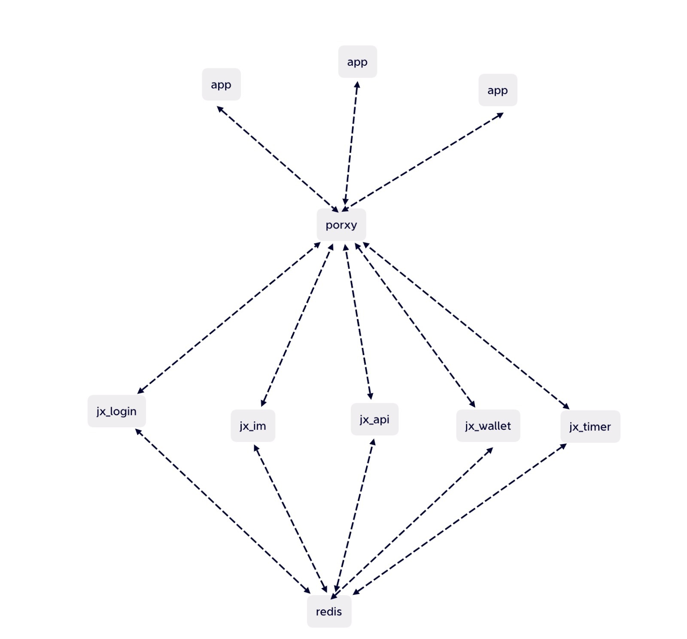

## IMCHAT

### proto使用手册
1. 先生成对应的proto文件，切记所有导入和设置的包名要保持。
2. 执行此语句生成对应的pb文件``protoc --go_out=. --go_opt=paths=source_relative \
   --go-grpc_out=. --go-grpc_opt=paths=source_relative \
   *.proto``
3. 可以根据实时转播的grpc教程直接调用方法来接收/发送数据给grpc服务器。
4. 此项目被当作grpc的客户端。

### jwt注意事项
1. 此项目使用了RS256的jwt加密token。
2. username，mobile_no，user_id 不可被使用为接口的参数名称。

### socket底层技术
1. 目前websocket的初期底层已经完成测试且放在了main.go。

### docker
1. docker buildx build --platform linux/amd64 -t gin-im-stag -f .docker/Dockerfile .
2. docker run --rm -p 20191:20191 jiasweejiangxia/gin-im-stag:[TAG]

### 项目全面图

### 小工具
1. https://github.com/panjf2000/ants (job/worker) - 并发提速4～6倍，服务器低延迟且内存表现稳定，不会无止境扩展。
2. go run translation/translation.go - 执行翻译小工具